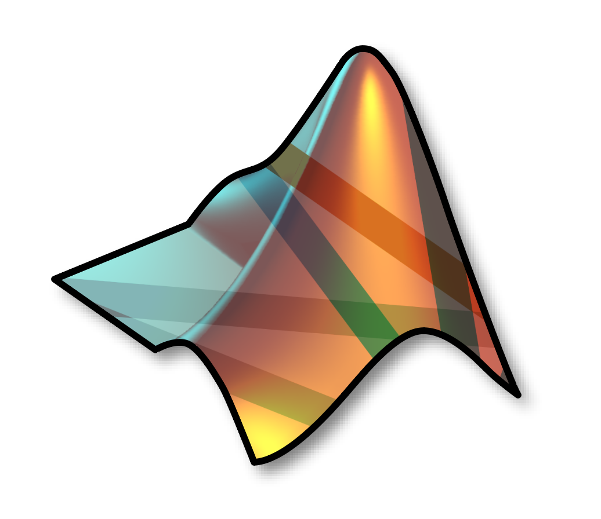

# Open Ephys Matlab Tools



## Overview

This repository is meant to centralize and standardize Matlab-specific tools for interacting with the [Open Ephys GUI](https://github.com/open-ephys/plugin-GUI).

It consists of three modules:

1. `analysis` - loads data in every format supported by the GUI, using a common interface

2. `control` - allows a Matlab process to control the GUI, locally or over a network connection

3. `streaming` - (under development) receives data from the GUI for real-time analysis and visualization in Matlab

## Installation

Latest version always available for download: 

[](https://www.mathworks.com/matlabcentral/fileexchange/122372-open-ephys-matlab-tools)

All scripts and classes are available in the open-ephys directory. Make sure the open-ephys directory and the data to be analyzed are both on the Matlab search path.

See the [control module README file](open_ephys/control/README.md) for how to setup zmq with Matlab.

Using the OpenEphysHTTPServer class is recommended for remote control of the GUI in v0.6+.

## Usage

Example scripts are included in the `examples` directory. The following sections provide a brief overview of the functionality of each module.

### analysis

```matlab
directory = '/path/to/data/2020-11-10_09-28-30' % for example

session = Session(directory) 
```

If the directory contains data from one more Record Nodes (GUI version 0.5+), the `session` object will contain a list of RecordNodes, accessible via `session.recordNodes[N]`, where `N = 1, 2, 3,`, etc.  

If your directory just contains data (any GUI version), individual recordings can be accessed via `session.recordings`. The format of the recordings will be detected automatically as either 
[Binary](https://open-ephys.github.io/gui-docs/User-Manual/Recording-data/Binary-format.html), 
[Open Ephys](https://open-ephys.github.io/gui-docs/User-Manual/Recording-data/Binary-format.html), 
[NWB 2.0](https://open-ephys.github.io/gui-docs/User-Manual/Recording-data/NWB-format.html).
 
([KWIK](https://open-ephys.github.io/gui-docs/User-Manual/Recording-data/KWIK-format.html) is no longer supported)

Each `recording` object has the following fields:

* `continuous` : continuous data for each subprocessor in the recording
* `spikes` : spikes for each electrode group
* `events` : Pandas `DataFrame` Matlab analog of event times and metadata
* `messages` : text messages sent to the GUI during recording

More details about `continuous`, `spikes`, and `events` objects can be found in the [analysis module README file](open_ephys/analysis/README.md).

### control

```matlab
host = '127.0.0.1' % IP address of the computer running Open Ephys
port = 37497 % EPHYS on a phone keypad 

gui = OpenEphysHTTPServer(host, port)

gui.acquire() % start acquisition
gui.record() % start recording
gui.idle() % stop recording and/or acquisition
gui.quit() % quit the GUI
```

See all API endpoints in the [control module README file](open_ephys/control/README.md).

### streaming

(coming soon)

## Contributing

This code base is under active development, and we welcome bug reports, feature requests, and external contributions. If you're working on an extension that you think would be useful to the community, don't hesitate to [submit an issue](https://github.com/open-ephys/open-ephys-matlab-tools/issues).
